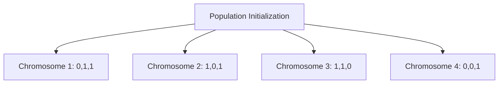
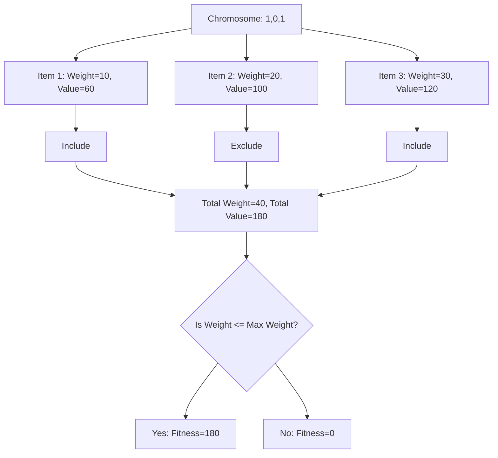
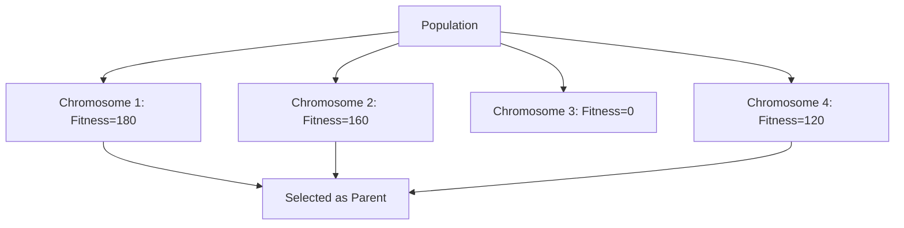
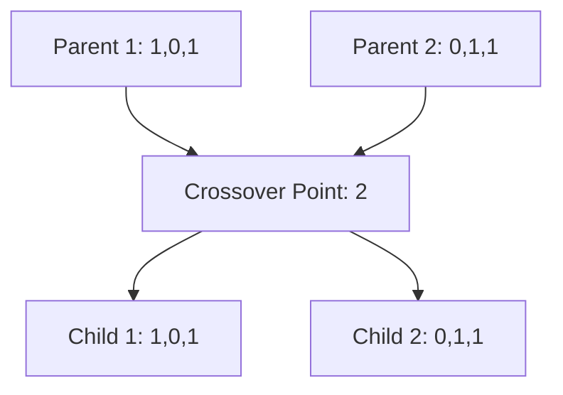
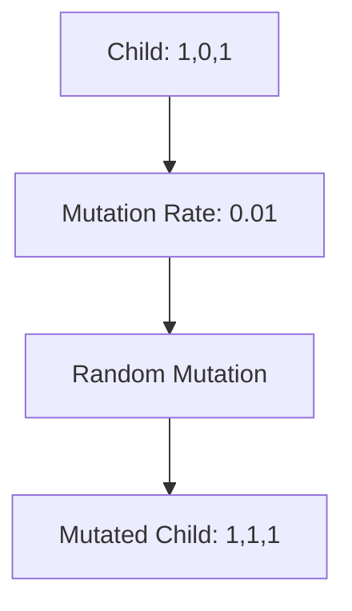
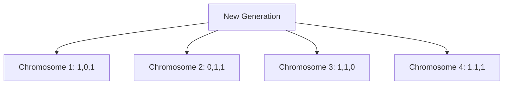
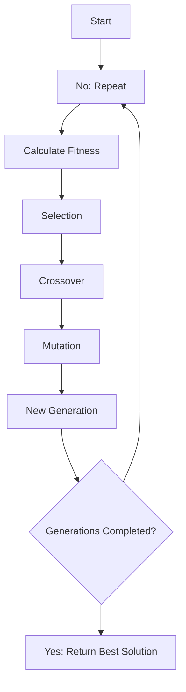

# Genetic Algorithm for the Knapsack Problem

This project implements a genetic algorithm to solve the 0/1 knapsack problem. The goal is to maximize the total value
of items in a knapsack without exceeding its weight capacity.

## Problem Statement

Given a set of items, each with a weight and a value, determine the number of each item to include in a collection so
that the total weight is less than or equal to a given limit and the total value is as large as possible.

## Implementation

### Chromosome

The `Chromosome` class represents a solution to the knapsack problem. Each chromosome has:

- **Genes**: A list of binary values indicating whether each item is included in the knapsack.
- **Items**: A list of items, each with a weight and a value.
- **Max Weight**: The maximum weight capacity of the knapsack.
- **Fitness**: The total value of the selected items, or 0 if the total weight exceeds the maximum capacity.

### Population

The `Population` class represents a population of chromosomes. It initializes a population with random chromosomes.

### Genetic Algorithm

The `GeneticAlgorithm` class handles the genetic algorithm's operations, including selection, crossover, mutation, and
running the algorithm over a number of generations.

### Main

The `main.py` file initializes the items, population, and genetic algorithm parameters, and runs the genetic algorithm
to find the best solution.

## Illustration

### Population Initialization

A population of chromosomes is initialized with random genes.



### Fitness Calculation

The fitness of each chromosome is calculated based on the total value of the selected items, considering the weight
constraint.



### Selection

The fittest individuals are selected to be parents for the next generation.



### Crossover

A crossover operation is performed between two parents to produce offspring.



### Mutation
A mutation operation introduces random changes to the genes of the offspring.



### New Generation
The new generation is formed from the offspring.



### Algorithm Execution
The genetic algorithm runs for a specified number of generations, evolving the population towards better solutions.



## How to Run the Project

1. Ensure you have Python installed.
2. Save the code files (`chromosome.py`, `population.py`, `genetic_algorithm.py`, and `main.py`) in a directory.
3. Run the `main.py` file:
    ```bash
    python main.py
    ```
4. The output will display the best solution found and its total value.

## Explanation

- **Chromosome Representation**: Each chromosome is a binary string where each bit represents whether an item is
  included in the knapsack.
- **Fitness Calculation**: Fitness is the total value of the items in the knapsack if the total weight is within the
  limit, otherwise, it's 0.
- **Selection**: The two fittest chromosomes are selected as parents for crossover.
- **Crossover**: A single-point crossover combines genes from two parents to produce a new chromosome.
- **Mutation**: Random bits in the chromosome are flipped based on the mutation rate to introduce variability.
- **Generations**: The algorithm runs for a specified number of generations, evolving the population towards better
  solutions.

This project demonstrates how genetic algorithms can be applied to optimization problems like the knapsack problem. The
code is modular, allowing for easy modification and experimentation with different parameters and methods.

