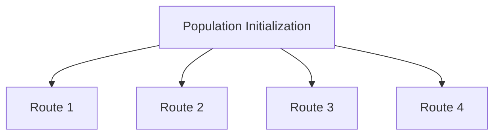
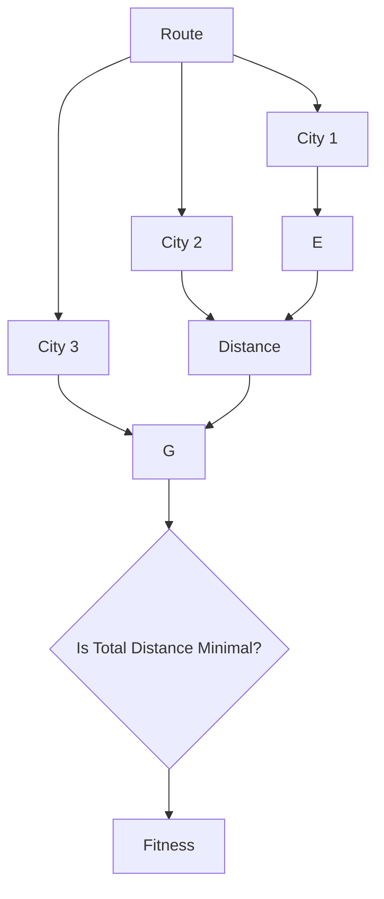
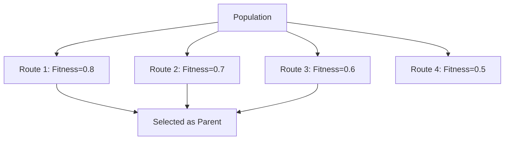
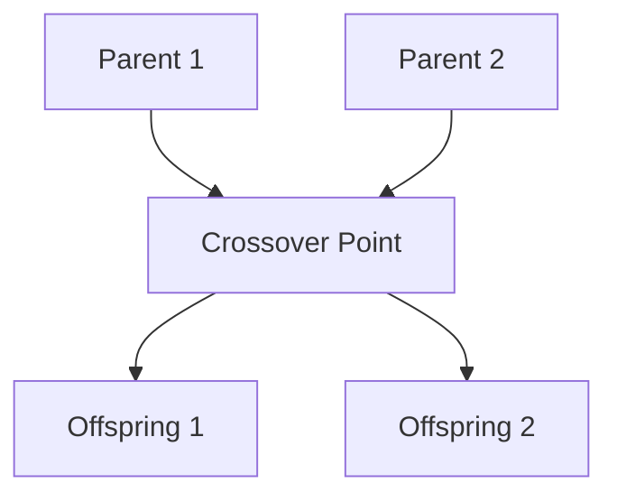
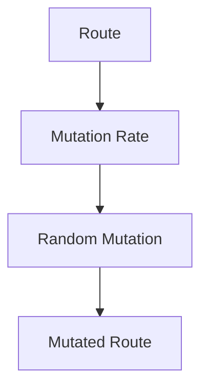
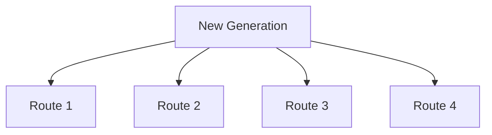
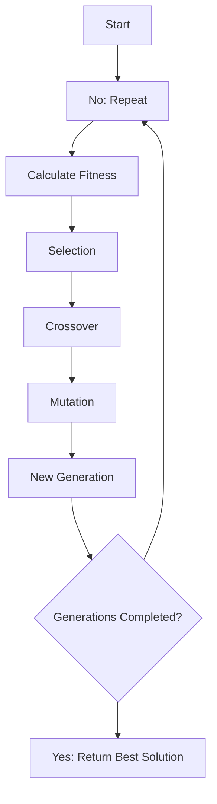

# Genetic Algorithm for the Traveling Salesman Problem

This project implements a genetic algorithm to solve the Traveling Salesman Problem (TSP). The objective is to find the
shortest possible route that visits each city exactly once and returns to the original city.

## Problem Statement

The Traveling Salesman Problem involves finding the most efficient route that allows a traveling salesman to visit all
cities in a given list exactly once and return to the starting city. The goal is to minimize the total distance
traveled.

## Implementation

### City

The `City` class represents a city with its coordinates on a 2D plane. It provides methods for calculating the distance
between two cities.

### Fitness

The `Fitness` class calculates the fitness of a route, which is inversely proportional to the total distance traveled. A
shorter route has a higher fitness score.

### Genetic Algorithm

The `GeneticAlgorithm` class handles the genetic algorithm's operations, including population initialization, selection,
crossover, mutation, and generation iteration.

### Main

The `main.py` file initializes the cities, population, and genetic algorithm parameters, and runs the genetic algorithm
to find the best route.

## Illustration

### Population Initialization

A population of routes is initialized randomly.



### Fitness Calculation

The fitness of each route is calculated based on the total distance traveled, considering the distances between cities.



### Selection

The fittest routes are selected to be parents for the next generation based on their fitness scores.



### Crossover

A crossover operation is performed between two parents to produce offspring routes.



### Mutation

A mutation operation introduces random changes to the routes' genes to maintain diversity in the population.



### New Generation

The new generation is formed from the offspring routes.



### Algorithm Execution

The genetic algorithm runs for a specified number of generations, evolving the population towards better solutions by
optimizing the route.



## How to Run the Project

1. Ensure you have Python installed.
2. Save the code files (`city.py`, `fitness.py`, `genetic_algorithm.py`, and `main.py`) in a directory.
3. Run the `main.py` file:
    ```bash
    python main.py
    ```
4. The output will display the best route found and its total distance.

## Explanation

- **City Representation**: Each city is represented by its coordinates on a 2D plane.
- **Fitness Calculation**: Fitness is the inverse of the total distance traveled in a route. Shorter routes have higher
  fitness scores.
- **Selection**: Routes are selected for crossover based on their fitness scores using roulette wheel selection.
- **Crossover**: Partially matched crossover (PMX) is used to combine genetic material from two parent routes to create
  offspring.
- **Mutation**: Random pairs of cities in the routes are swapped with a certain probability to introduce variability.
- **Generations**: The algorithm iterates for a specified number of generations, continuously improving the population
  towards better solutions.

This project demonstrates the application of genetic algorithms to solve optimization problems like the Traveling
Salesman Problem. The code is modular and can be easily modified or extended for experimentation with different
parameters and methods.