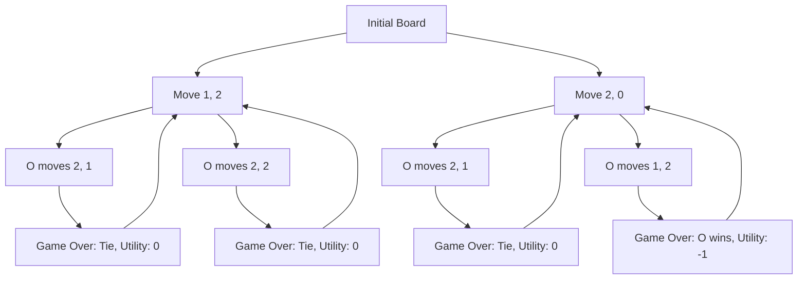

# Tic Tac Toe Game

This project implements a Tic Tac Toe game that can be played either through a graphical interface using Pygame or
through a terminal interface. The game includes an AI opponent that uses the Minimax algorithm to play optimally.

## Problem Statement

To implement a fully functional Tic Tac Toe game where a user can play against an AI opponent that always makes the
optimal move.

## Game Implementation

### Tic Tac Toe Logic

The core game logic is implemented in the `tictactoe.py` file, which includes the following functionalities:

- **Initial State**: Returns the starting state of the board.
- **Player Turn**: Determines which player's turn it is based on the current state of the board.
- **Possible Actions**: Returns all possible actions (i.e., empty cells) on the board.
- **Resulting Board**: Returns the new board state after a player makes a move.
- **Winner**: Checks if there is a winner.
- **Terminal State**: Checks if the game is over.
- **Utility**: Returns the utility of the board (1 if X wins, -1 if O wins, 0 for a tie).
- **Minimax Algorithm**: Determines the optimal move for the AI.

### Graphical Interface with Pygame

The `pygame_runner.py` file provides a graphical interface for the game using Pygame. It includes:

- **Screen Initialization**: Sets up the display screen with a size of 600x400 pixels.
- **User Interaction**: Lets the user choose to play as X or O.
- **Game Loop**: Handles the game loop, including drawing the board, checking for user input, and making AI moves.
- **Game Over Handling**: Displays the result of the game and provides an option to play again.

### Terminal Interface

The `terminal_runner.py` file provides a terminal-based interface for the game. It includes:

- **Print Board**: Prints the current state of the board in a readable format.
- **User Input**: Prompts the user to enter their move.
- **Game Loop**: Handles the game loop, including printing the board, checking for user input, and making AI moves.
- **Game Over Handling**: Prints the result of the game once it is over.

## Solution

The solution uses the Minimax algorithm to ensure that the AI always makes the optimal move. The Minimax algorithm is
implemented in a recursive manner, where the AI considers all possible moves and their outcomes to choose the move that
maximizes its chances of winning (or minimizes its chances of losing).

### Minimax Algorithm Details

- **Maximizing and Minimizing**: The algorithm alternates between maximizing and minimizing players (X and O) to find
  the optimal move.
- **Recursive Evaluation**: Evaluates the board recursively to determine the best possible move for the current player.
- **Pruning**: Utilizes alpha-beta pruning to improve efficiency by eliminating branches that do not need to be
  explored.

## How to Run the Game

### Graphical Interface

1. Ensure you have Pygame installed:
    ```bash
    pip install pygame
    ```
2. Run the `pygame_runner.py` file:
    ```bash
    python pygame_runner.py
    ```

### Terminal Interface

1. Run the `terminal_runner.py` file:
    ```bash
    python terminal_runner.py
    ```

## Example Illustration

### Game Start

When you start the game, you can choose to play as either X or O.

### Player and AI Moves

- If you choose to play as X, you will make the first move.
- The AI (playing as O) will then make its move using the Minimax algorithm.
- The game continues until there is a winner or the board is full (resulting in a tie).

### Game Over

Once the game is over, the result is displayed:

- If there is a winner, the winning player is announced.
- If the game is a tie, it is declared a draw.

### Play Again

After the game is over, you have the option to play again by clicking the "Play Again" button in the graphical interface
or restarting the terminal interface.

## Graphical Illustration

Sure! Here is an illustration of how the Minimax algorithm works using a Mermaid graph. This example demonstrates the
decision-making process for the AI when determining the optimal move.

### Minimax Algorithm Example

Consider the following Tic Tac Toe board where it's X's turn to move:

```
X | O | X
---------
O | X | 
---------
  |   | O
```

The AI needs to determine the best move for X. The possible moves are (1, 2) and (2, 0).



### Explanation

1. **Initial Board State**:
    ```
    X | O | X
    ---------
    O | X | 
    ---------
      |   | O
    ```
   The AI (playing as X) needs to choose between two possible moves: (1, 2) or (2, 0).

2. **Evaluating Move (1, 2)**:
    ```
    X | O | X
    ---------
    O | X | X
    ---------
      |   | O
    ```
    - If O moves to (2, 1):
      ```
      X | O | X
      ---------
      O | X | X
      ---------
      O | O | O
      ```
      The game ends in a tie (utility = 0).
    - If O moves to (2, 2):
      ```
      X | O | X
      ---------
      O | X | X
      ---------
      O |   | O
      ```
      The game ends in a tie (utility = 0).

   The Minimax value for move (1, 2) is the minimum of 0 and 0, which is 0.

3. **Evaluating Move (2, 0)**:
    ```
    X | O | X
    ---------
    O | X | 
    ---------
    X |   | O
    ```
    - If O moves to (2, 1):
      ```
      X | O | X
      ---------
      O | X | 
      ---------
      X | O | O
      ```
      The game ends in a tie (utility = 0).
    - If O moves to (1, 2):
      ```
      X | O | X
      ---------
      O | X | O
      ---------
      X |   | O
      ```
      O wins (utility = -1).

   The Minimax value for move (2, 0) is the minimum of 0 and -1, which is -1.

4. **Choosing the Best Move**:
    - Move (1, 2) has a Minimax value of 0.
    - Move (2, 0) has a Minimax value of -1.

   The AI will choose the move with the highest Minimax value, which is (1, 2), with a value of 0.

This process ensures that the AI always makes the optimal move to maximize its chances of winning or drawing, while
minimizing the chances of losing.