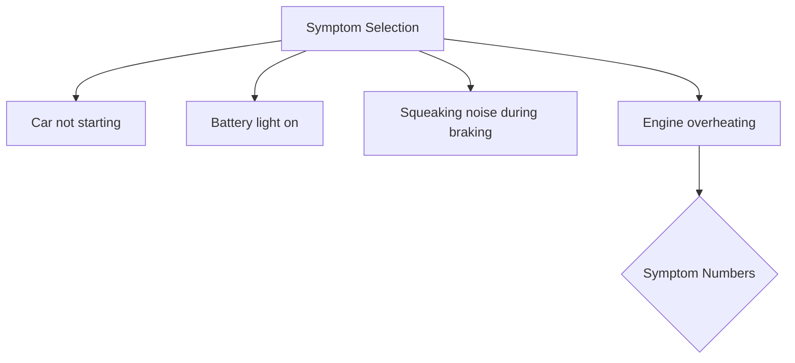
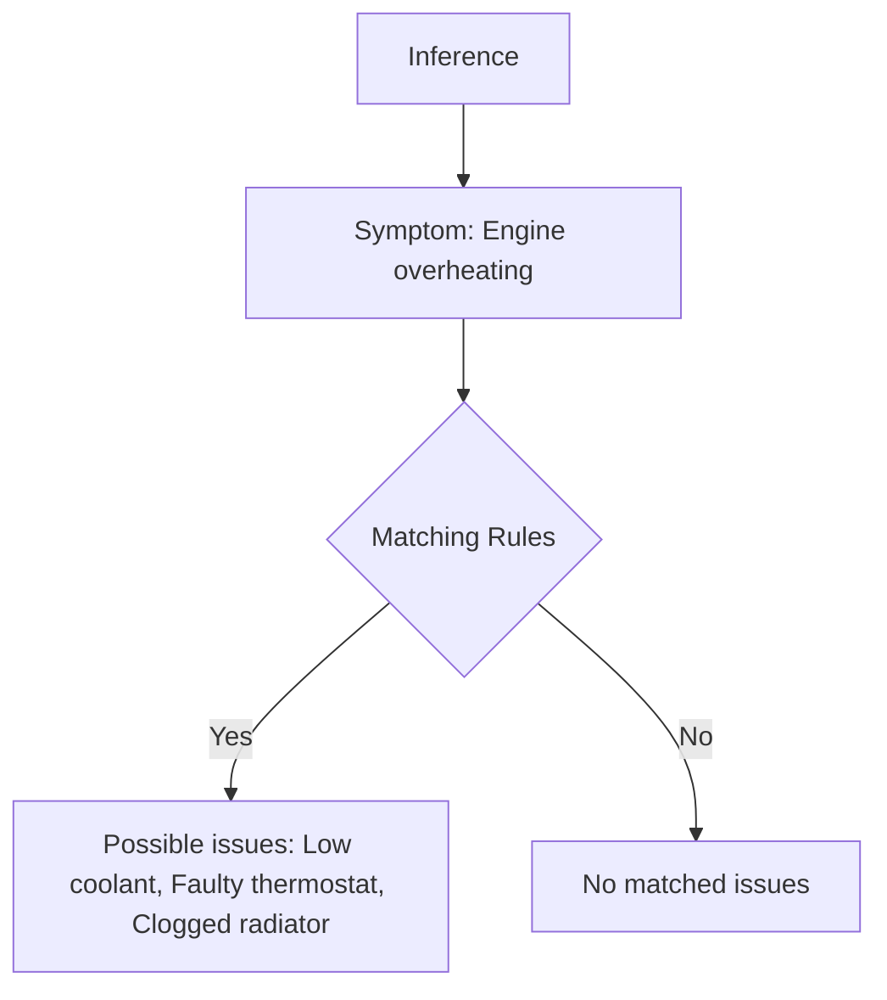

# Car Diagnostic Tool

This project implements a simple diagnostic tool for identifying possible car issues based on symptoms provided by the user.

## Problem Statement

The Car Diagnostic Tool aims to assist users in identifying potential issues with their cars by inputting symptoms they are experiencing. The tool matches the symptoms against predefined rules to suggest possible problems.

## Implementation

### Rules

The `Rules` class in `rules.py` contains predefined rules mapping symptoms to possible car issues.

### Car Engine

The `CarEngine` class in `car_engine.py` handles user interaction, symptom selection, and inference of possible issues based on the provided symptoms.

### Main

The `main.py` file serves as the entry point, initializing the `CarEngine` object and running the diagnostic tool.

## Illustration

### Symptom Selection

Users are prompted to select symptoms their car is experiencing from a list. Symptom numbers are entered to make selections.



### Inference

The selected symptoms are matched against predefined rules to infer possible car issues.



## How to Use the Tool

1. Ensure you have Python installed.
2. Clone or download the project files.
3. Navigate to the project directory in your terminal.
4. Run the `main.py` file:
    ```bash
    python main.py
    ```
5. Follow the prompts to select symptoms your car is experiencing.
6. The tool will display possible issues based on the selected symptoms.

## Explanation

- **Rules Definition**: Predefined rules are set in the `Rules` class, mapping symptoms to possible car issues.
- **Symptom Selection**: Users input symptom numbers corresponding to the symptoms their car is exhibiting.
- **Inference**: The tool matches selected symptoms against predefined rules to suggest possible car issues.
- **User Interaction**: The tool guides users through symptom selection and displays inferred issues.

This project provides a basic yet effective tool for diagnosing car issues based on user-provided symptoms. It offers a simple interface for users to interact with and can be extended with additional rules for broader coverage of car problems.