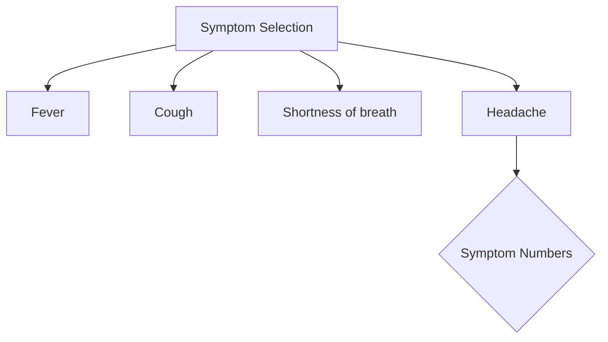
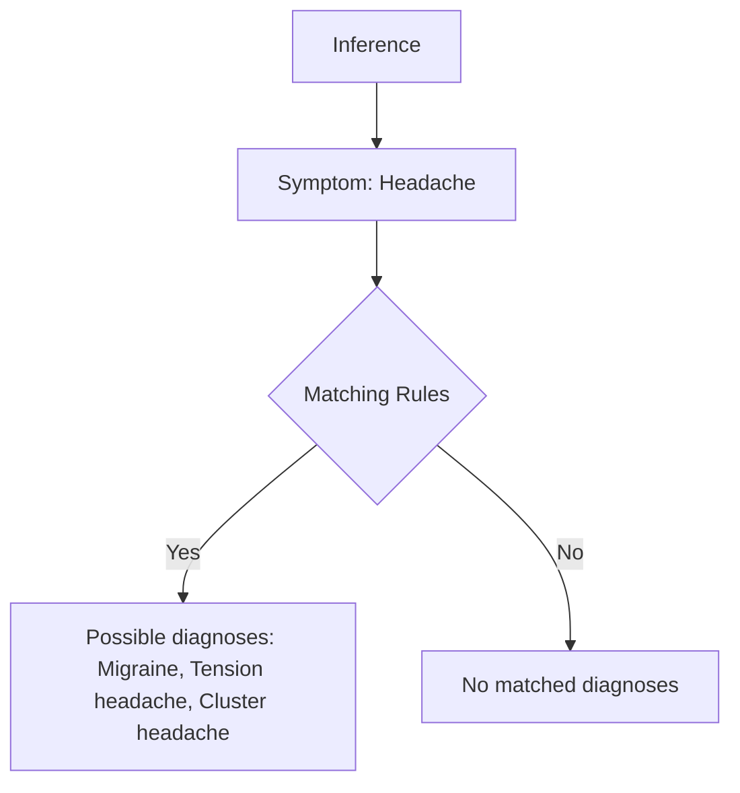

# Medical Diagnostic Tool

This project implements a medical diagnostic tool for identifying possible health issues based on symptoms provided by the user.

## Problem Statement

The Medical Diagnostic Tool aims to assist users in identifying potential health problems by inputting symptoms they are experiencing. The tool matches the symptoms against predefined rules to suggest possible diagnoses.

## Implementation

### Rules

The `Rules` class in `rules.py` contains predefined rules mapping symptoms to possible health issues.

### Medical Diagnostic

The `MedicalDiagnostic` class in `medical_diagnostic.py` handles user interaction, symptom selection, and inference of possible diagnoses based on the provided symptoms.

### Main

The `main.py` file serves as the entry point, initializing the `MedicalDiagnostic` object and running the diagnostic tool.

## Illustration

### Symptom Selection

Users are prompted to select symptoms they are experiencing from a list. Symptom numbers are entered to make selections.



### Inference

The selected symptoms are matched against predefined rules to infer possible health issues.



## How to Use the Tool

1. Ensure you have Python installed.
2. Clone or download the project files.
3. Navigate to the project directory in your terminal.
4. Run the `main.py` file:
    ```bash
    python main.py
    ```
5. Follow the prompts to select symptoms you are experiencing.
6. The tool will display possible diagnoses based on the selected symptoms.

## Explanation

- **Rules Definition**: Predefined rules are set in the `Rules` class, mapping symptoms to possible health issues.
- **Symptom Selection**: Users input symptom numbers corresponding to the symptoms they are exhibiting.
- **Inference**: The tool matches selected symptoms against predefined rules to suggest possible health issues.
- **User Interaction**: The tool guides users through symptom selection and displays inferred diagnoses.

This project provides a basic yet effective tool for diagnosing health issues based on user-provided symptoms. It offers a simple interface for users to interact with and can be extended with additional rules for broader coverage of health problems.