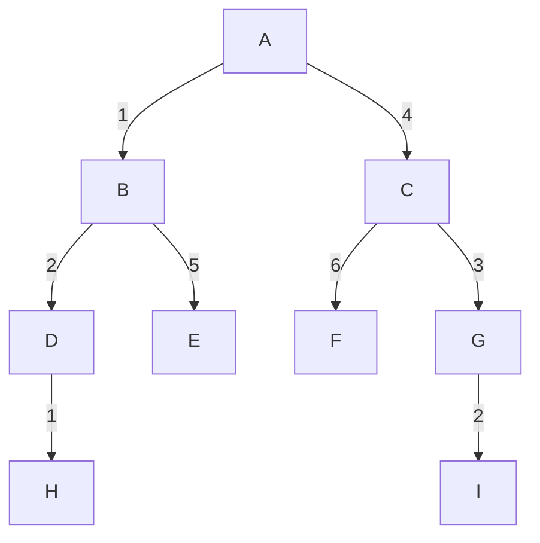
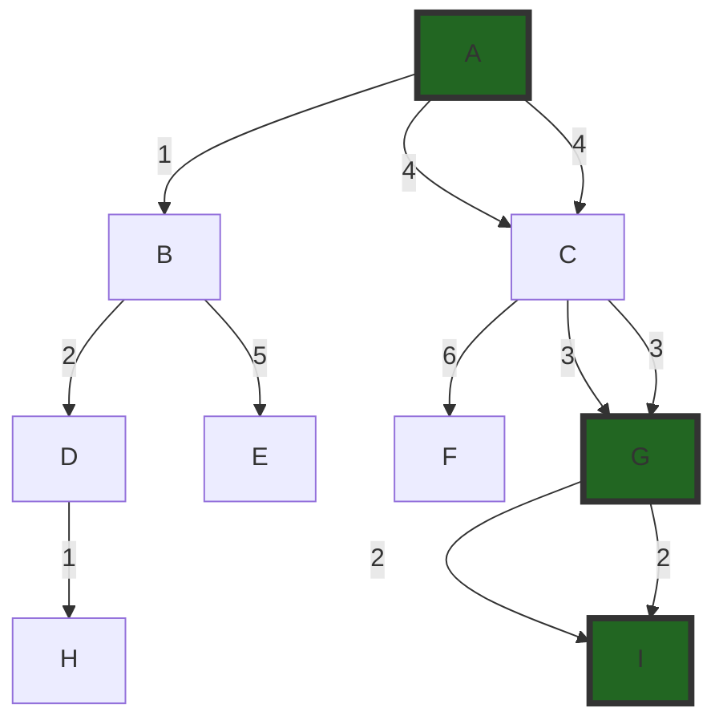

# Problem Statement

To find the optimal path from one node to another in a weighted graph using informed search algorithms.

# Problem Illustration

# Heuristics

The heuristic values used for A* Search and Greedy Best-First Search are as follows:

* A: 7
* B: 6
* C: 2
* D: 5
* E: 3
* F: 1
* G: 0
* H: 8
* I: 4

# Solution

The solution employs four informed search algorithms:

>* __Uniform Cost Search (UCS):__
Expands the least-cost node first, ensuring that the shortest path is found. It handles varying edge costs effectively.

>* __A* Search:__
Combines the cost to reach a node and a heuristic estimate of the cost to reach the goal, aiming to find the shortest path efficiently. The heuristic should be admissible, meaning it never overestimates the true cost.

>* __Greedy Best-First Search:__
Expands the node with the lowest heuristic cost, focusing on paths that appear promising according to the heuristic. While it can be fast, it doesn't always guarantee the shortest path.

>* __Dijkstra's Algorithm:__
Similar to UCS, it expands the least-cost node first. It ensures the shortest path is found by updating the costs of reaching each node iteratively.

# Solution Illustration

## If Target is from A to I
### Optimal Path Using UCS, A*, Greedy Best-First Search, and Dijkstra's Algorithm

