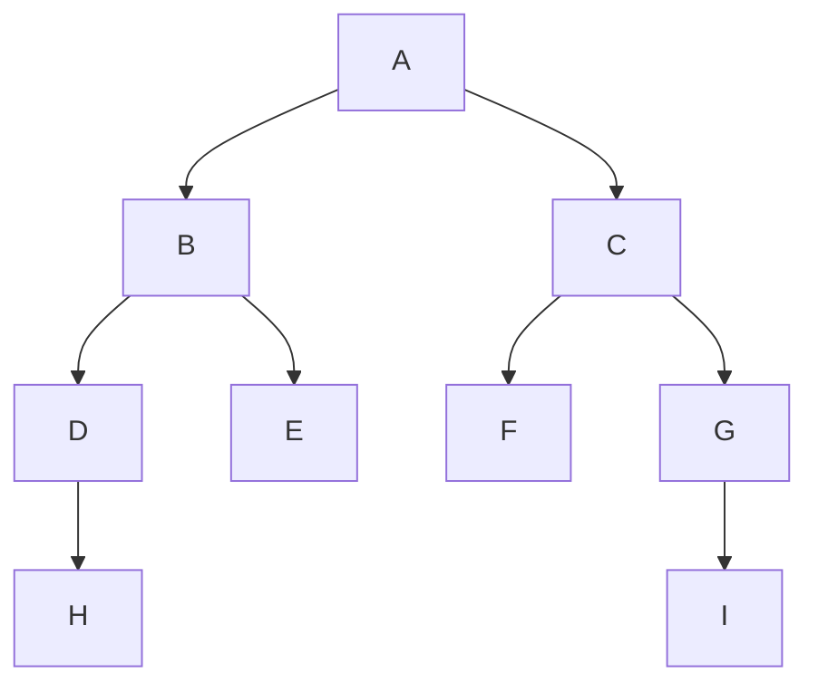
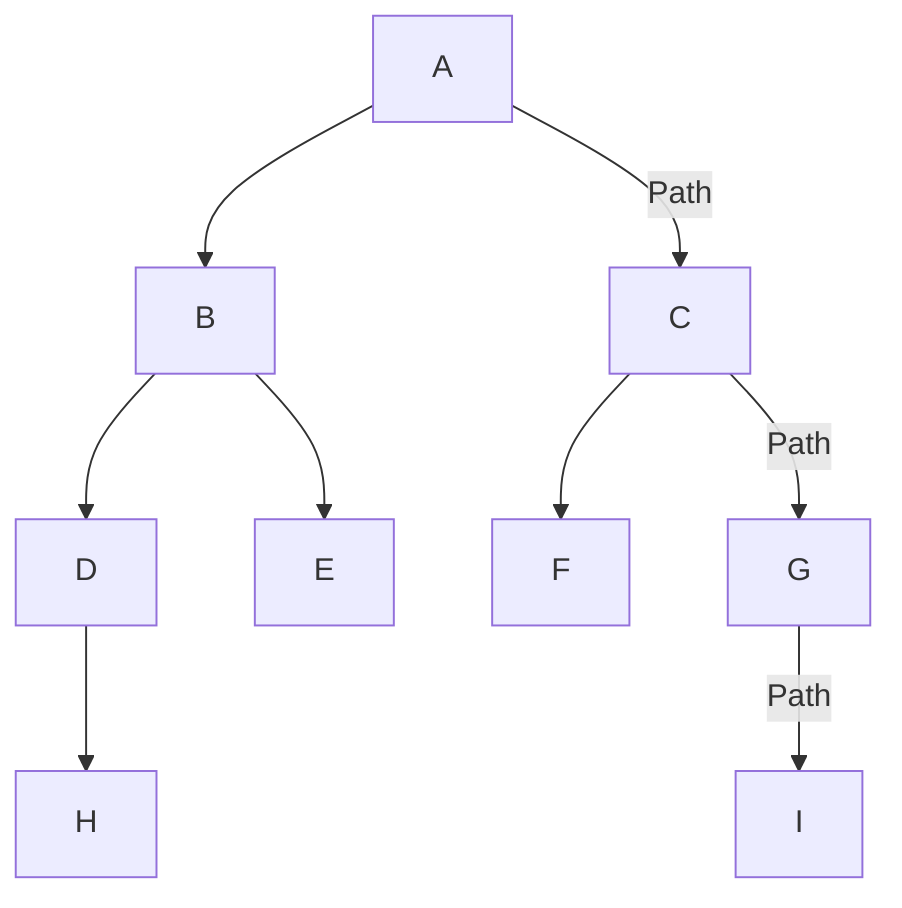

# Problem Statement

To find optimal path from one node to another in an unweighted graph using some search algorithm.

# Problem Illustration

# Solution

Solution is through using two algorithms:

> * __Breath First Search__:
    Conducts a systematic exploration of the graph, progressing layer by layer until the target node is found. This
    method ensures a result is always produced and avoids entrapment within loops.

> * __Depth First Search__:
    Delves deeply into each branch of the graph, probing its depth until the target node is located. While this method
    may
    not consistently yield a result due to potential loop entanglement, it offers a comprehensive exploration of the
    graph's structure.

# Solution Illustration

## If Target is from A to I

